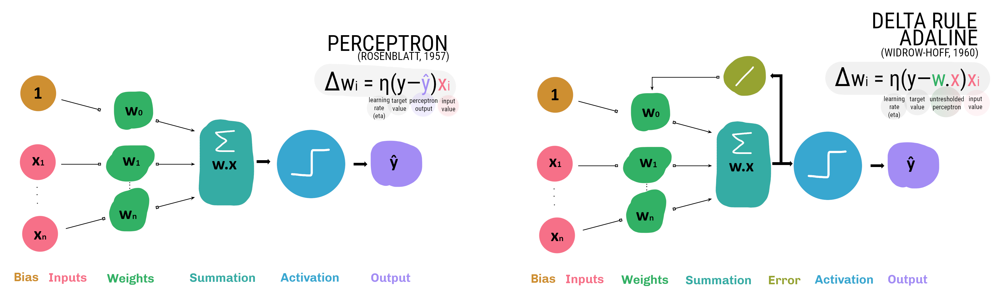
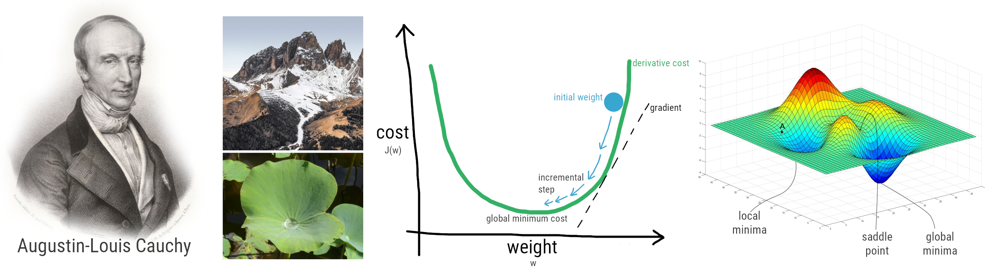
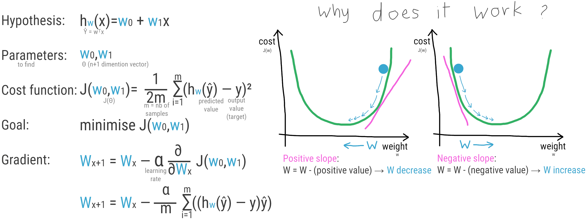
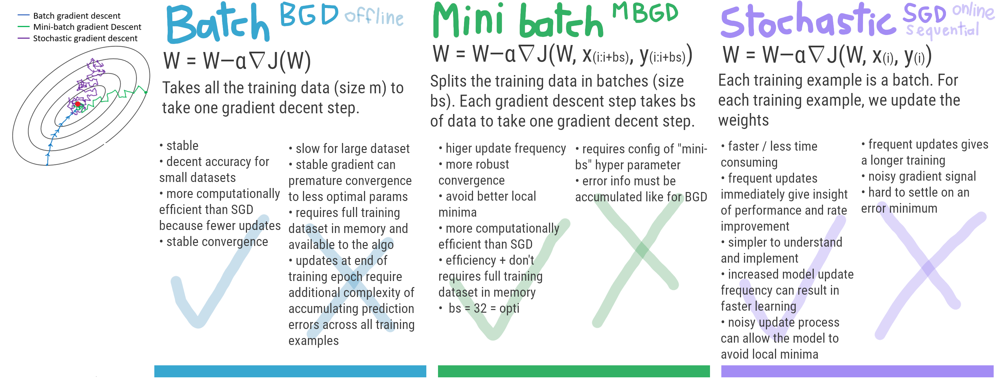
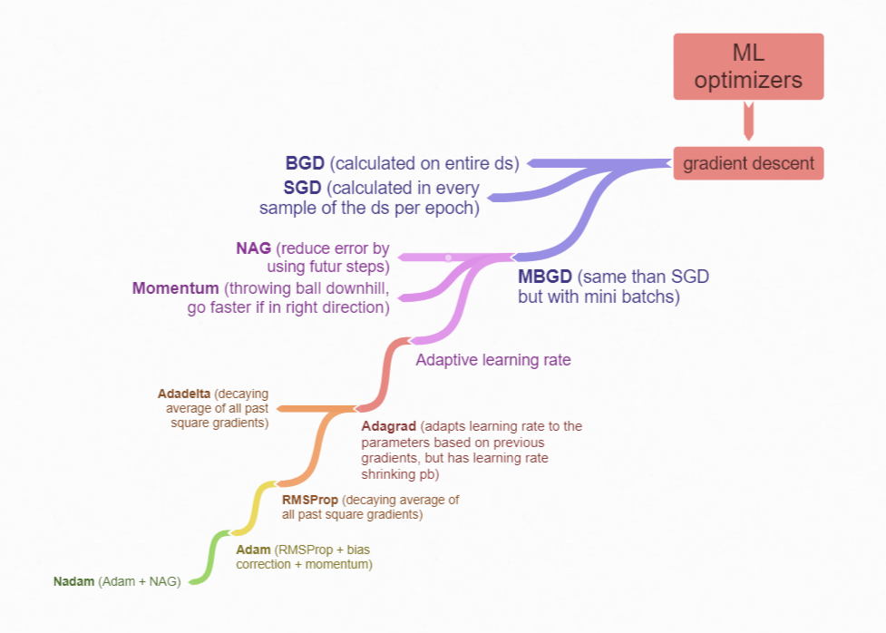
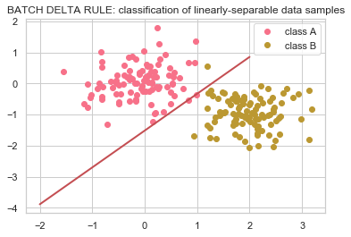
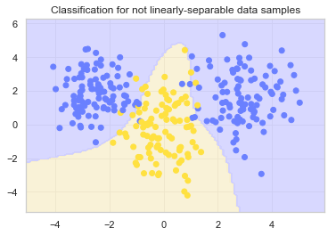

# Artificial Neural Networks labs

### Lab 1: Learning and generalisation in feed-forward networks from perceptron learning to backprop

[Lab instructions](https://github.com/tgll/neuralnetworks-labs/blob/master/lab1/annda_lab1.pdf)

Visualise the [code](https://nbviewer.jupyter.org/github/tgll/neuralnetworks-labs/blob/master/lab1/lab1-perceptron.ipynb) with Nbviewer

#### In this lab:

Perceptron learning VS delta learning

Batch learning VS sequential learning

Optimizers

Optimizers Mindmap

(full mindmap [here](https://coggle.it/diagram/XbOLnq4hARCMvhuY/t/cognitive-sciences-related-knowledge))

Linearly separable data VS not linearly separable data

------

### See the other labs [here](https://github.com/tgll/neuralnetworks-labs)